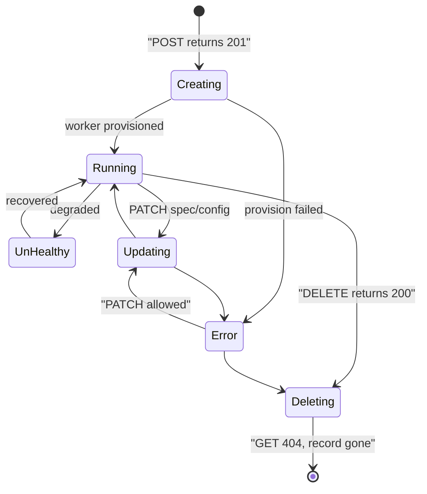
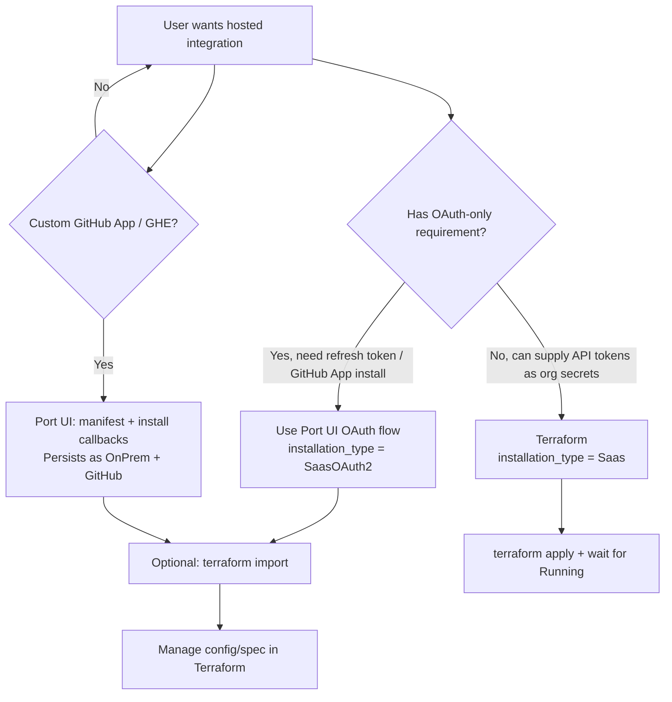
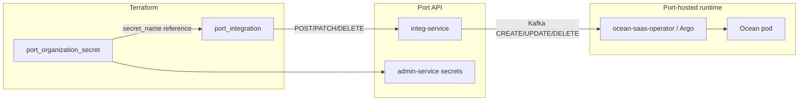
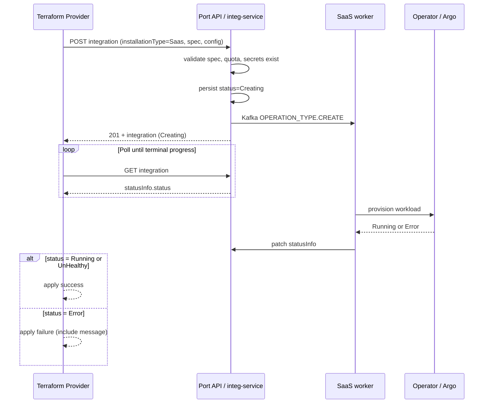
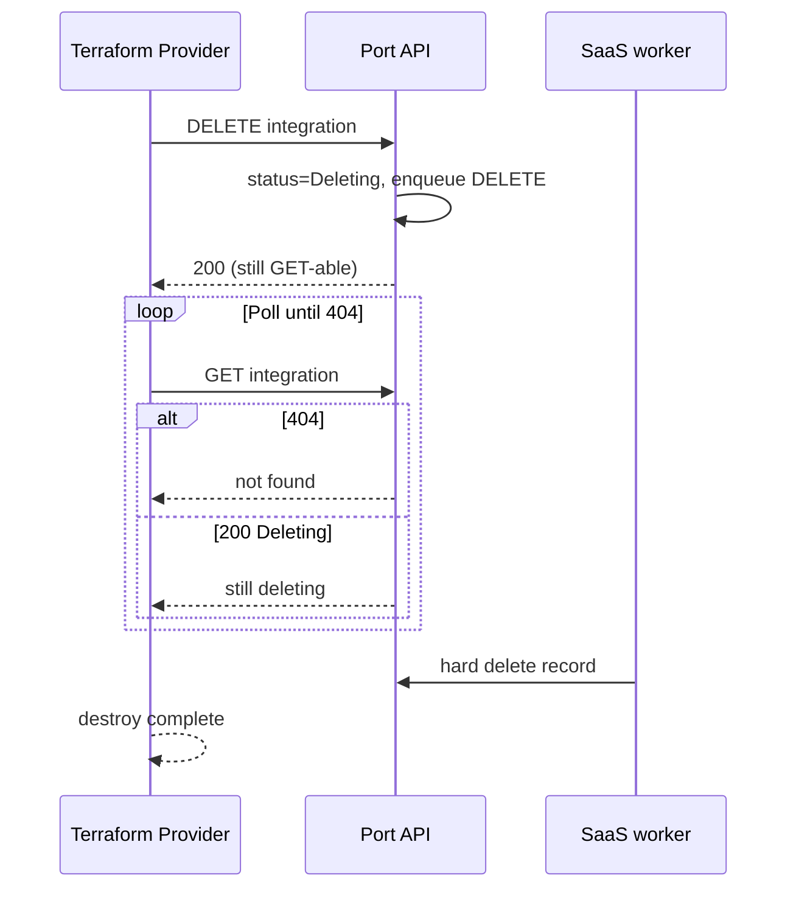

# Terraform Provider: Port-Hosted (SaaS) Integrations

## Background

Port supports two ways to run an **Ocean integration**:

| Hosting mode | `installation_type` | Who runs the workload | Typical user action |
| --- | --- | --- | --- |
| **Self-hosted (OnPrem)** | `OnPrem` (default) | Customer infrastructure (Helm, Docker, etc.) | Deploy Ocean exporter; Port stores mappings only |
| **Port-hosted (SaaS)** | `Saas` | Port-managed Kubernetes (dedicated pod per integration) | Configure credentials and mappings in Port; no cluster to operate |

Port-hosted integrations are defined in the **Ocean catalog** (`~/ocean/integrations/*/.port/spec.yaml`). Each integration declares whether SaaS is enabled (`saas.enabled`), which configuration fields are required or sensitive, and optionally an OAuth installation path (`saas.oauthConfiguration`).

The **Terraform provider** (`port_integration`) lets teams manage integrations as code: create, update, import, and destroy alongside blueprints and actions. OnPrem support is implemented and smoke-tested. **SaaS support is partially implemented** on branch `task_tkl1fp/install_saas_integration_with_terraform` but exposes the full backend enum without modeling async lifecycle, server-owned fields, or installation paths that cannot be completed via REST.

This document is the **feature design** for completing SaaS support correctly — grounded in the actual contracts in `~/port` (integ-service, port-api, oauth-service) and `~/ocean` (integration specs).

---

## The problem we are solving

### 1. Users cannot safely manage Port-hosted integrations with Terraform today

Engineering teams want to:

- Provision GitLab, Jira, Linear, Datadog, and other hosted integrations from the same Terraform module that manages Port blueprints.
- Store **non-secret** configuration in Terraform state and **secrets** in `port_organization_secret`.
- Import existing UI-created SaaS integrations into Terraform without surprise replacements.
- Run `terraform apply` and know the integration is **actually running**, not stuck in `Creating` or `Error`.

Today, accepting all five `installation_type` values and a single opaque `spec` blob creates **false success** and **silent drift**.

### 2. The backend enum is wider than what REST + Terraform can complete

The API accepts five `installation_type` values (`~/port/packages/common-consts/src/integration.ts`):

| Value | REST POST accepted? | Actually provisioned? | Terraform-viable? |
| --- | --- | --- | --- |
| `OnPrem` | Yes (default) | Metadata only; customer runs Ocean | **Yes** |
| `Saas` | Yes | Async K8s deploy via integ-service | **Yes** (with org secrets) |
| `SaasOAuth2` | Yes (schema) | OAuth callback sets type + jq-derived secrets | **No** — requires browser OAuth |
| `CustomGithubApp` | Yes (schema) | **No writer in codebase**; creates OnPrem shell | **No** |
| `EnterpriseGithubApp` | Yes (schema) | **No writer in codebase**; creates OnPrem shell | **No** |

Git history confirms `CustomGithubApp` / `EnterpriseGithubApp` were introduced with multi-workspace GitHub App work (`93dba619d7`) but **never assigned** by any create path. Real custom/enterprise GitHub installs use manifest + install callbacks and persist as **`OnPrem`**.

### 3. SaaS lifecycle is asynchronous; Terraform assumes synchronous CRUD



Without status polling:

- `terraform apply` succeeds while the integration is still `Creating`.
- Failed provisions (`Error`) are invisible until the next manual refresh.
- `terraform destroy` + immediate `apply` with the same `installation_id` fails with `IntegrationAlreadyExistError` during the `Deleting` soft window.

### 4. `spec` shape causes perpetual or hidden drift

SaaS integrations store hosting configuration in `spec`:

```json
{
  "integrationSpec": { "gitlabHost": "...", "tokenMapping": "<org-secret-name>" },
  "appSpec": { "scheduledResyncInterval": "4h", "liveEventsEnabled": true },
  "systemSpec": { "size": "M" },
  "privateSpec": { "applierBackend": "operator" }
}
```

The backend **injects** server-owned fields on create (`liveEventsUuid`, `liveEventsIngestHostname`, `systemSpec.size`, boolean defaults). Sensitive `integrationSpec` values must be **organization secret names** (lookup in `specValidator`), not literal tokens.

The current provider:

- Uses one sensitive `spec` JSON string.
- Only writes `spec` to state on first read (skips refresh when state exists) — hiding real drift.
- Does not split user-owned vs computed fields.

### 5. Coverage expectation vs reality

**24 Ocean integrations** have `saas.enabled: true`:

| Category | Count | Examples | OAuth also available |
| --- | --- | --- | --- |
| Plain token/key SaaS | 18 | `linear`, `snyk`, `sonarqube`, `okta`, `aws-v3` | No |
| OAuth-capable SaaS | 6 | `github`, `gitlab`, `gitlab-v2`, `jira`, `pagerduty`, `datadog` | Yes (UI flow → `SaasOAuth2`) |

**All 24** are reachable as `installation_type = "Saas"` when the user supplies org secrets manually. OAuth is a **UI convenience**, not a separate Terraform capability.

---

## Goals and non-goals

### Goals

- Support **`OnPrem` and `Saas`** fully in `port_integration` with no broken intermediate states.
- Fail **at plan time** for installation types and configurations Terraform cannot complete.
- Model **async create/update/delete** so apply/destroy semantics match operator expectations.
- Expose a **clear, drift-resistant** configuration surface for `integrationSpec` and `appSpec`.
- Document **per-integration** sensitive field requirements (derived from Ocean specs).
- Maintain **import** and **smoke-test** coverage for representative SaaS types.

### Non-goals

- **OAuth install flows** (`SaasOAuth2`) — remain UI/oauth-service only; Terraform may **import** integrations created that way.
- **Custom / Enterprise GitHub App** enum values — not used by backend; real flow is interactive and stores `OnPrem`.
- **Replacing Port UI** for first-time OAuth or GitHub App manifest installs.
- **Managing Ocean workload internals** (pod sizing policies, Argo vs operator) beyond read-only computed fields.

---

## Technical design

### Functional requirements

| ID | Requirement |
| --- | --- |
| FR-1 | User can create `installation_type = "Saas"` with `installation_app_type`, `config` (mappings), and `spec` / decomposed spec fields. |
| FR-2 | Sensitive `integration_spec` fields reference `port_organization_secret.secret_name`, not secret values. |
| FR-3 | Provider rejects `SaasOAuth2`, `CustomGithubApp`, `EnterpriseGithubApp` at **plan** with actionable errors. |
| FR-4 | `installation_type` change forces **replacement** (backend PATCH ignores it). |
| FR-5 | After create/update, provider waits until status ∉ `{Creating, Updating}`; fails apply on `Error`. |
| FR-6 | After delete, provider waits until GET returns **404** before completing destroy. |
| FR-7 | User can import existing SaaS integration by `installation_id`. |
| FR-8 | SaaS `installation_id` validated: `^[a-z][a-z0-9-]*[a-z0-9]$`, max length **20**. |
| FR-9 | Computed `status` (and optional `status_message`) exposed for SaaS resources. |
| FR-10 | `version` omitted for SaaS by default (Port-managed); pinning optional with drift warning in docs. |

### Installation type decision matrix



### High-level Terraform resource model



### Resource schema (target)

#### Shared (OnPrem + SaaS)

| Attribute | Type | Notes |
| --- | --- | --- |
| `installation_id` | string, required, force new | SaaS: stricter pattern + max 20 |
| `installation_app_type` | string, optional, force new | e.g. `gitlab`, `jira` |
| `installation_type` | string, optional, computed default `OnPrem`, force new | Validator: `OnPrem`, `Saas` only |
| `title` | string, optional | |
| `config` | string (JSON), optional | Entity mappings (jq) |
| `version` | string, optional, computed | Omit for SaaS unless intentional |
| `webhook_changelog_destination` | block, optional | Add/update only; removal unsupported |
| `kafka_changelog_destination` | object, optional | |

#### SaaS-only

| Attribute | Type | Notes |
| --- | --- | --- |
| `integration_spec` | string (JSON), sensitive | User-owned hosting config |
| `app_spec` | nested block | See table below; Optional + Computed per field |
| `system_spec` | nested block, computed | `size` only |
| `status` | string, computed | `Creating`, `Running`, `Error`, etc. |
| `status_message` | string, computed | From `statusInfo.integrationStatus.message` |

**`app_spec` fields** (from `integ-service-client` `appSpecSchema`):

| Field | Type | Validation |
| --- | --- | --- |
| `scheduled_resync_interval` | string | `1h`, `2h`, `3h`, `4h`, `6h`, `12h`, `24h`, `7d` |
| `incremental_sync_interval` | string | `15m`, `30m`, `1h` |
| `send_raw_data_examples` | bool | |
| `live_events_enabled` | bool | Server may default |
| `lakehouse_enabled` | bool | |
| `actions_processing_enabled` | bool | Mirrored from root; server default `false` |
| `incremental_sync_enabled` | bool | Requires capability in Ocean spec |
| `live_events_uuid` | string, computed | Server-generated |
| `live_events_ingest_hostname` | string, computed | Server-generated |

**Deprecation:** `spec` (monolithic JSON) accepted for one release; internally maps to `integration_spec` + `app_spec`.

### Sensitive field contract

For each key in Ocean `configurations[]` where `sensitive: true`, the value in `integration_spec` must be a **string** matching an existing org secret name.

Backend validation (`specValidator.ts`):

1. `typeof value === 'string'`
2. `adminClient.org(orgId).secret(value).get()` succeeds

Otherwise: `400 invalid_configuration` — *"The provided secret does not exist"*.

**Terraform pattern:**

```hcl
resource "port_organization_secret" "gitlab_tokens" {
  secret_name  = "prod-gitlab-token-mapping"
  secret_value = jsonencode({ "glpat-xxx" = ["**"] })
}

resource "port_integration" "gitlab" {
  installation_id       = "prod-gitlab"
  installation_type     = "Saas"
  installation_app_type = "gitlab"

  integration_spec = jsonencode({
    gitlabHost   = "https://gitlab.com"
    tokenMapping = port_organization_secret.gitlab_tokens.secret_name
  })

  app_spec {
    scheduled_resync_interval = "4h"
    live_events_enabled       = true
  }

  config = jsonencode({ /* mappings */ })
}
```

### Create / update / delete sequences

#### Create (SaaS)



#### Delete (SaaS)



#### Update semantics

| Change | Behavior |
| --- | --- |
| `config` (mappings) | In-place PATCH |
| `integration_spec` / `app_spec` | In-place PATCH → status `Updating` → poll |
| `installation_id`, `installation_app_type`, `installation_type` | Force replacement |
| Remove `webhook_changelog_destination` | **Rejected** by provider (API cannot clear) |
| Fix `Error` integration | PATCH allowed (do not force recreate) |

### Integration catalog reference (Ocean)

#### OAuth-capable (use `Saas` in Terraform with manual secrets, or UI for `SaasOAuth2`)

| Integration | Required secrets (typical) | `integrationSpec` overrides (OAuth) |
| --- | --- | --- |
| `github` | `githubAppPrivateKey` | `githubHost`, `githubAppId` |
| `gitlab` | `tokenMapping` | `gitlabHost` |
| `gitlab-v2` | `gitlabToken` | `gitlabHost` |
| `jira` | `atlassianUserEmail`, `atlassianUserToken` | `jiraHost` |
| `pagerduty` | `token` | `apiUrl` |
| `datadog` | `datadogApiKey`, `datadogApplicationKey`, `datadogAccessToken` | `datadogBaseUrl` |

#### Plain SaaS (token/key only)

`aikido`, `amplication`, `armorcode`, `aws-v3`, `azure-devops`, `bitbucket-cloud`, `checkmarx-one`, `claude`, `claude-managed-agents`, `cursor`, `custom`, `github-copilot`, `komodor`, `launchdarkly`, `linear`, `okta`, `snyk`, `sonarqube` — each follows the same pattern: required non-sensitive fields in `integration_spec`, sensitive fields as org secret names per `.port/spec.yaml`.

---

## Risks and mitigations

| Risk | Impact | Mitigation |
| --- | --- | --- |
| User sets `SaasOAuth2` expecting Terraform OAuth | Broken or hand-crafted install | Plan-time rejection + docs link to UI flow + import |
| `CustomGithubApp` POST creates empty OnPrem record | False success | Remove from provider enum |
| Stuck `Creating` forever | Silent partial provision | Poll with timeout; surface last status in error |
| Delete/recreate same `installation_id` races | `IntegrationAlreadyExistError` | Wait for 404 on delete |
| False drift on `app_spec` server fields | Noisy plans | Optional+Computed on server-owned fields |
| Hidden drift on `integration_spec` | Security/compliance gap | Normal refresh on user-owned spec |
| `saasIntegrationsLimit` exceeded | Opaque API error | Translate to clear diagnostic with plan limits |
| Quota / provisioning delay | Flaky smoke tests | Retry helpers (already in smoke script) |
| Import OAuth integration | Secrets not in TF | Document: import spec references existing secret names |

### OnPrem vs SaaS — provider behavior comparison

| Dimension | OnPrem | SaaS |
| --- | --- | --- |
| Default `installation_type` | `OnPrem` | Must set `Saas` |
| `spec` required | No | Yes (`integration_spec` / `app_spec`) |
| Create returns | `Running` (sync) | `Creating` (async) |
| Delete | Sync remove metadata | Async `Deleting` → 404 |
| `status` attribute | N/A (not in API) | Computed from `statusInfo` |
| `version` | Often pinned | Port-managed; omit recommended |
| Secrets in spec | N/A (env/helm) | Org secret **names** only |
| Hosted limit | None | `saasIntegrationsLimit` per org plan |

---

## Implementation plan

### Phase 1 — Correctness guardrails (P0)

| Task | DOD |
| --- | --- |
| Narrow `installation_type` to `OnPrem`, `Saas` | Plan fails for other values with guided errors |
| `RequiresReplace` on `installation_type` | `terraform plan` shows replace on type change |
| SaaS `installation_id` validation | Plan fails before API for invalid SaaS IDs |
| Delete waits for 404 | Smoke: destroy → apply same id succeeds |
| Create/update poll + fail on `Error` | Smoke: apply fails visibly on bad secret |

### Phase 2 — Schema decomposition (P1)

| Task | DOD |
| --- | --- |
| Add `integration_spec`, `app_spec`, `system_spec` | Examples + docs updated |
| Deprecate monolithic `spec` | Old HCL still works one release |
| Computed `status` / `status_message` | Visible in `terraform show` |
| `app_spec` enum validation | Plan catches bad resync intervals |

### Phase 3 — Documentation and catalog (P1)

| Task | DOD |
| --- | --- |
| port-docs SaaS tab | OnPrem/SaaS examples, secret pattern, import |
| Per-type sensitive field table | Generated or linked from Ocean specs |
| OAuth / GitHub App callout | "Create in UI, import to Terraform" |

### Phase 4 — Test matrix (P1)

| Scenario | Method |
| --- | --- |
| Plain SaaS create/update/destroy | `linear`, `gitlab` in smoke (`SMOKE_SAAS=true`) |
| Variety loop | `saas_variety` in `~/terraform/smoke/saas.tf` |
| Error path | Invalid secret name → apply error |
| Import | `terraform import port_integration.x <installation_id>` |
| Delete window | Destroy + immediate apply |
| OnPrem regression | Full smoke without SaaS fields |

---

## Rollout plan

1. **Merge OnPrem-only PR** (current branch) — no SaaS schema exposure in production provider release until Phase 1 complete.
2. **SaaS branch PR** with Phase 1 + 2; internal smoke on prod `.env` with `SMOKE_SAAS=true`.
3. **Provider pre-release** to select customers; gather feedback on `integration_spec` vs monolithic `spec`.
4. **General availability** after smoke variety pass + docs published to port-docs.
5. **Remove deprecated `spec`** in following major/minor per Terraform provider versioning policy.

---

## Post-launch monitoring

| Signal | Source | Action |
| --- | --- | --- |
| SaaS apply failures with `Error` status | Customer reports / smoke CI | Improve error messages |
| Stuck `Creating` poll timeout | Provider logs | Tune timeout; document provisioning SLA |
| `IntegrationAlreadyExistError` after destroy | Provider issue | Verify delete polling |
| Drift on `integration_spec` | Support tickets | Verify refresh logic |
| Hosted limit errors | Translated diagnostic | Point to plan upgrade |

---

## Documentation deliverables

| Audience | Content |
| --- | --- |
| **Engineers** | This design doc; provider schema reference; examples per integration type |
| **Team leads** | Installation type matrix; OAuth vs Terraform boundary; capability table |
| **Customers (port-docs)** | Hosted vs self-hosted tabs; org secrets; import; immutable fields; status behavior |

---

## Decision log

| Date | Decision | Rationale |
| --- | --- | --- |
| 2026-09-07 | Support only `OnPrem` + `Saas` in Terraform | Only REST-completable paths; `SaasOAuth2` needs oauth-service; Custom/Enterprise enums unused |
| 2026-09-07 | Reject unusable enum values at plan time | API accepts but does not provision — worse than clear error |
| 2026-09-07 | Poll create/update/delete for SaaS | Backend is async; sync CRUD misleads Terraform |
| 2026-09-07 | Do not taint on `Error` | Backend allows PATCH to recover failed integrations |
| 2026-09-07 | Split `spec` into user vs computed fields | Server injects defaults; monolithic spec hides drift |
| 2026-09-07 | All 24 Ocean SaaS types reachable via `Saas` + secrets | OAuth is optional UX; manual secrets equivalent for IaC |
| 2026-09-07 | Import for UI-created OAuth integrations | Cannot create `SaasOAuth2` in TF; can manage config after import |

---

## Open questions

| Question | Owner | Notes |
| --- | --- | --- |
| Poll timeout defaults for create vs update? | Provider | Align with operator P99 provision time |
| Expose full `status_info` block vs flat `status`? | Provider / PM | Flat sufficient for v1 |
| Generate per-integration TF examples from Ocean specs? | Docs / tooling | Reduces maintenance |
| Should provider prefetch org secret existence at plan? | Provider | Optional enhancement; API validates at apply |
| Data source for integration catalog (`saas.enabled`)? | Future | Helps dynamic modules |

---

## References

| Resource | Path |
| --- | --- |
| Installation type constants | `~/port/packages/common-consts/src/integration.ts` |
| SaaS create controller | `~/port/apps/integ-service/src/api/controllers/integrationController.ts` |
| Spec validation | `~/port/apps/integ-service/src/validators/specValidator.ts` |
| OAuth create strategy | `~/port/apps/oauth-service/src/core/strategies/abstractStrategy.ts` |
| GitHub App callbacks | `~/port/apps/oauth-service/src/api/controllers/githubAppController.ts` |
| Ocean integration specs | `~/ocean/integrations/*/.port/spec.yaml` |
| Provider SaaS branch | `terraform-provider-port-labs` branch `task_tkl1fp/install_saas_integration_with_terraform` |
| Smoke stack | `~/terraform/smoke/saas.tf` |
